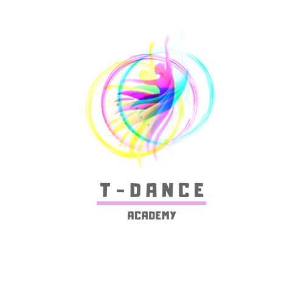
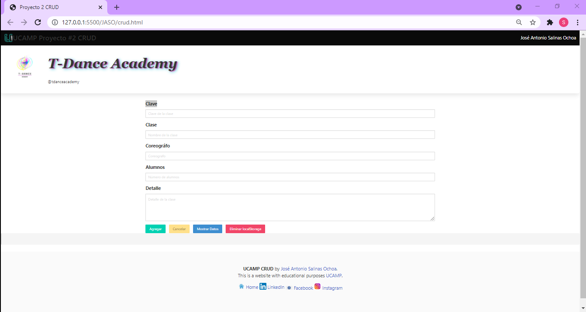

# Proyecto 2: CRUD - [C]reate/[R]ead/[U]pdate/[D]elete

## **Índice**

* [1. Intro](#1-intro)
* [2. Objetivo](#2-objetivo)
* [3. Demo](#3-demo)

## 1. Intro

Existen funciones o procesos muy comunes o básicas que se pueden realizar sobre un conjunto de datos.
Una de éstas funciones o procesos son los CRUDs, mismos que involucran todo un conjunto de operaciones
sobre una entidad.

## 2. Objetivo

Conocer, Entender, Aprender y Poner en práctica el concepto CRUD, cuyo significado indica:
- C => CREAR ... en inglés Create, significa crear o agregar nuevos elementos a una base de datos.
- R => LEER ... en inglés Read, significa consultar la información de un elemento(s).
- U => ACTUALIZAR ... en inglés Update, significa modificar la información de un elemento(s) que ya existen en la base de datos.
- D => BORRAR ... en inglés Delete, significa tomar un elemento o elementos y eliminarlo(s) de la base de datos.

## 3. Demo

